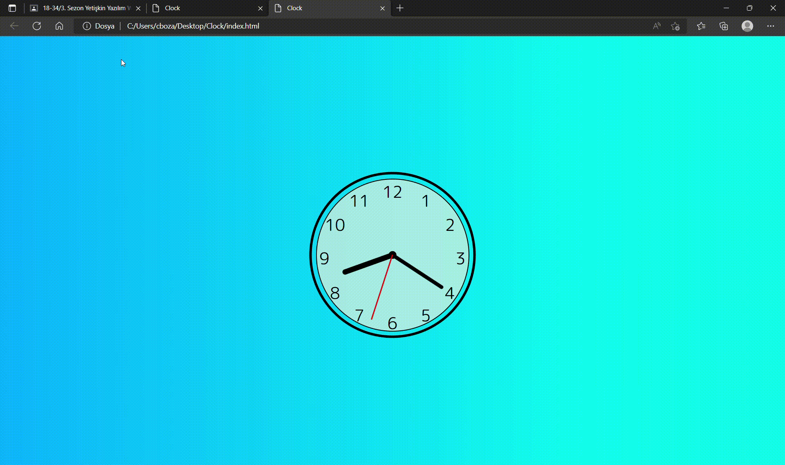

# Analog_Clock

<h1>How it made?
<h6>After an intensive 'css translate' study, it has been provided movement with javascript.   
Along with going by seconds, minutes and then hours come simultaneously where they have to be on the clock. 
